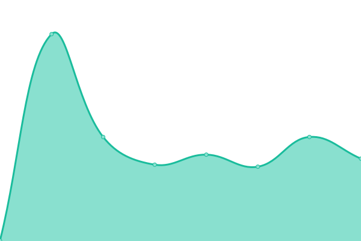
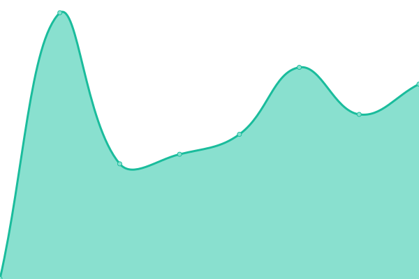
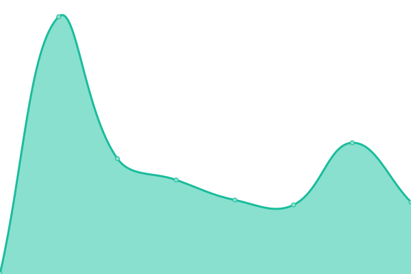
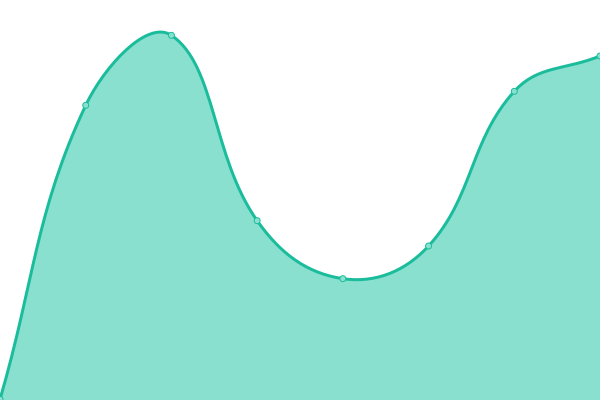

# [📈 Live Status](https://upptime.github.io/upptime): <!--live status--> **🟧 Partial outage**

This repository contains the open-source uptime monitor and status page for [Upptime](https://upptime.js.org), powered by [Upptime](https://github.com/upptime/upptime).

With [Upptime](https://upptime.js.org), you can get your own unlimited and free uptime monitor and status page, powered entirely by a GitHub repository. We use [Issues](https://github.com/upptime/upptime/issues) as incident reports, [Actions](https://github.com/kaster-io/upptime/actions) as uptime monitors, and [Pages](https://upptime.github.io/upptime) for the status page.

<!--start: status pages-->
<!-- This summary is generated by Upptime (https://github.com/upptime/upptime) -->
<!-- Do not edit this manually, your changes will be overwritten -->
<!-- prettier-ignore -->
| URL | Status | History | Response Time | Uptime |
| --- | ------ | ------- | ------------- | ------ |
|  [Kaster.io](https://kaster.io/) | 🟩 Up | [kaster-io.yml](https://github.com/kaster-io/upptime/commits/HEAD/history/kaster-io.yml) | 

 237ms
     
 | 

<a href="https://kaster-io.github.io/upptime/history/kaster-io">100.00%</a>
    

|  [Tankengine (APP)](https://the.tankengine.app/) | 🟩 Up | [tankengine-app.yml](https://github.com/kaster-io/upptime/commits/HEAD/history/tankengine-app.yml) | 

 355ms
     
 | 

<a href="https://kaster-io.github.io/upptime/history/tankengine-app">100.00%</a>
    

|  [Tankengine (Marketing)](https://www.tankengine.app/) | 🟩 Up | [tankengine-marketing.yml](https://github.com/kaster-io/upptime/commits/HEAD/history/tankengine-marketing.yml) | 

 309ms
     
 | 

<a href="https://kaster-io.github.io/upptime/history/tankengine-marketing">100.00%</a>
    

|  [Realtors wordsmith (APP)](https://app.realtorwordsmith.com/dashboard) | 🟩 Up | [realtors-wordsmith-app.yml](https://github.com/kaster-io/upptime/commits/HEAD/history/realtors-wordsmith-app.yml) | 

 495ms
     
 | 

<a href="https://kaster-io.github.io/upptime/history/realtors-wordsmith-app">100.00%</a>
    

|  [Realtors wordsmith (Marketing)](https://www.realtorwordsmith.com/) | 🟩 Up | [realtors-wordsmith-marketing.yml](https://github.com/kaster-io/upptime/commits/HEAD/history/realtors-wordsmith-marketing.yml) | 

 326ms
     
 | 

<a href="https://kaster-io.github.io/upptime/history/realtors-wordsmith-marketing">100.00%</a>
    

|  [URLTrack (APP)](https://app.urltrack.io/dashboard) | 🟩 Up | [url-track-app.yml](https://github.com/kaster-io/upptime/commits/HEAD/history/url-track-app.yml) | 

 4072ms
     
 | 

<a href="https://kaster-io.github.io/upptime/history/url-track-app">100.00%</a>
    

|  [URLTrack (Marketing)](https://www.urltrack.io/) | 🟩 Up | [url-track-marketing.yml](https://github.com/kaster-io/upptime/commits/HEAD/history/url-track-marketing.yml) | 

 399ms
     
 | 

<a href="https://kaster-io.github.io/upptime/history/url-track-marketing">100.00%</a>
    

|  [RubbertHunt](https://www.rubberhunt.com/) | 🟩 Up | [rubbert-hunt.yml](https://github.com/kaster-io/upptime/commits/HEAD/history/rubbert-hunt.yml) | 

 381ms
     
 | 

<a href="https://kaster-io.github.io/upptime/history/rubbert-hunt">100.00%</a>
    

|  [Portal](https://portal-kaster-io.vercel.app/) | 🟥 Down | [portal.yml](https://github.com/kaster-io/upptime/commits/HEAD/history/portal.yml) | 

 1100ms
     
 | 

<a href="https://kaster-io.github.io/upptime/history/portal">0.00%</a>
    

|  [TankEngine](https://the.tankengine.app/) | 🟩 Up | [tank-engine.yml](https://github.com/kaster-io/upptime/commits/HEAD/history/tank-engine.yml) | 

 266ms
     
 | 

<a href="https://kaster-io.github.io/upptime/history/tank-engine">100.00%</a>
    

<!--end: status pages-->

[**Visit our status website →**](https://upptime.github.io/upptime)

## 📄 License

- Powered by: [Upptime](https://github.com/upptime/upptime)
- Code: [MIT](./LICENSE) © [Anand Chowdhary](https://anandchowdhary.com), supported by [Pabio](https://pabio.com)
- Data in the `./history` directory: [Open Database License](https://opendatacommons.org/licenses/odbl/1-0/)
